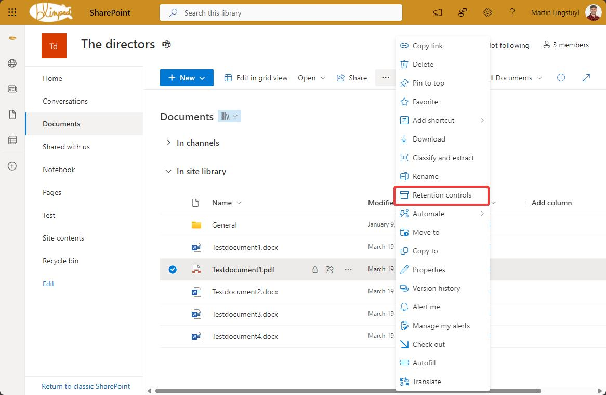
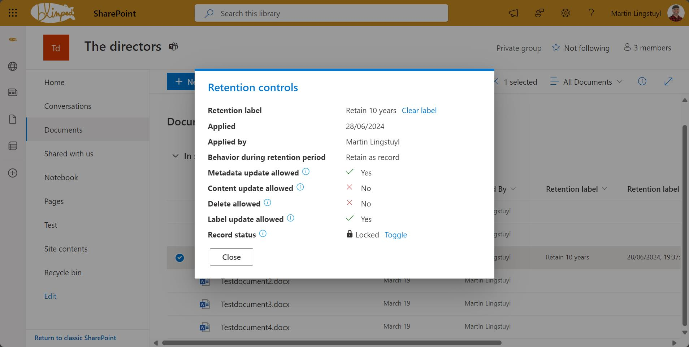
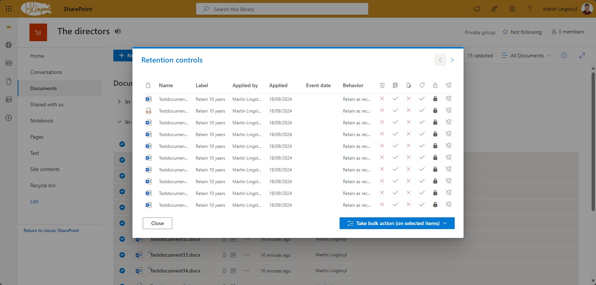
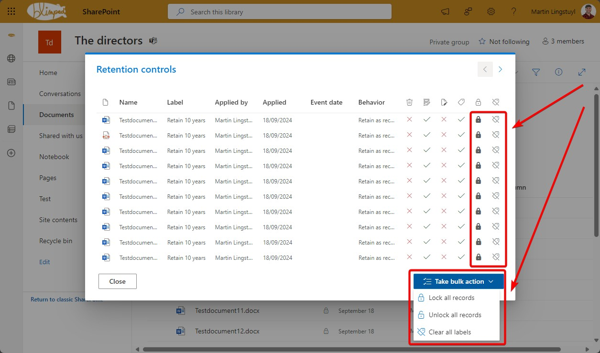

# blimped-spfx-retention-controls

## Summary

Using this solution you can:

- view retention information from files and folders labeled with a retention label.
- toggle record lock status
- clear the retention label from a file or folder.
- bulk toggle record status for selected items or the entire library.
- bulk clear labels for selected items or the entire library.

This solution comes in handy if you choose to not publish any retention label, for example for purposes of automatic labelling. In such a scenario, the retention label dropdown would not be visible, and thus it would be impossible to clear the label of an item.

Opening the Retention Controls dialog:

Viewing retention information for a single selected item:

Viewing retention information for multiple selected items or the entire library:

Taking action on a single item, all selected items or the entire library:

> "Take bulk action" encompasses the entire library if no items were selected before opening the retention controls dialog.

## Permissions 

It's possible to restrict the actions of the retention controls extension to specific Entra ID groups or users. For more information, see [Retention Controls Permissions Configuration](PERMISSIONS.md). 

## Used SharePoint Framework Version

## Applies to

- [SharePoint Framework](https://aka.ms/spfx)
- [Microsoft 365 tenant](https://docs.microsoft.com/sharepoint/dev/spfx/set-up-your-developer-tenant)
- [Purview](https://learn.microsoft.com/purview/create-apply-retention-labels)

> Get your own free development tenant by subscribing to [Microsoft 365 developer program](http://aka.ms/o365devprogram)

## Prerequisites

> Publish the SPFx package to your app catalog
> Ensure the solution is made available across your tenant

## Disclaimer

**THIS CODE IS PROVIDED _AS IS_ WITHOUT WARRANTY OF ANY KIND, EITHER EXPRESS OR IMPLIED, INCLUDING ANY IMPLIED WARRANTIES OF FITNESS FOR A PARTICULAR PURPOSE, MERCHANTABILITY, OR NON-INFRINGEMENT.**

---

## Minimal Path to Awesome

- Clone this repository
- Ensure that you are at the solution folder
- in the command-line run:
  - **npm install**
  - **gulp serve**

> Include any additional steps as needed.

## References

- [Getting started with SharePoint Framework](https://docs.microsoft.com/en-us/sharepoint/dev/spfx/set-up-your-developer-tenant)
- [Building for Microsoft teams](https://docs.microsoft.com/en-us/sharepoint/dev/spfx/build-for-teams-overview)
- [Use Microsoft Graph in your solution](https://docs.microsoft.com/en-us/sharepoint/dev/spfx/web-parts/get-started/using-microsoft-graph-apis)
- [Publish SharePoint Framework applications to the Marketplace](https://docs.microsoft.com/en-us/sharepoint/dev/spfx/publish-to-marketplace-overview)
- [Microsoft 365 Patterns and Practices](https://aka.ms/m365pnp) - Guidance, tooling, samples and open-source controls for your Microsoft 365 development
